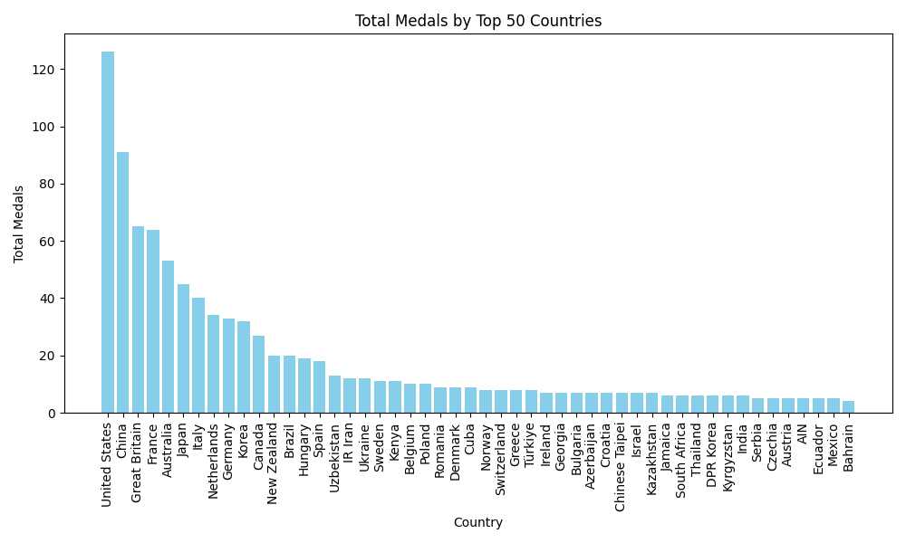

# Summary Statistics Report (Entire Dataset using Polars)

## Mean Total Medals: 11.33695652173913
## Median Total Medals: 5.0
## Standard Deviation of Total Medals: 19.61064813579046
## Min Total Medals: 1
## Max Total Medals: 126
## Data Visualization for Top 50 Countries

